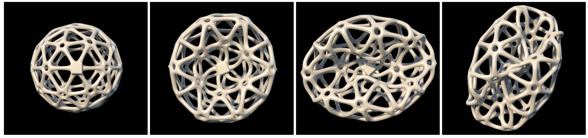

# Higher-order Finite Elements for Embedded Simulation

This repository contains the source code used to produce the results for our paper:

[Longva, A., Löschner, F., Kugelstadt, T., Fernández-Fernández, J.A. and Bender, J., 2020.
*Higher-order finite elements for embedded simulation*.
ACM Transactions on Graphics (TOG), 39(6), pp.1-14.](https://dl.acm.org/doi/10.1145/3414685.3417853)

Please also see the [entry on our website](https://animation.rwth-aachen.de/publication/0572/)
for access to the paper, the supplemental document, video and more.



## Important information

The code provided here is almost entirely unchanged from the code used to generate the results
demonstrated in the paper. After publication, we have discovered a couple of mistakes that we detail
in our [errata](errata.pdf). The code has deliberately **not** been updated to account for these mistakes.

The code is provided only for the sake of giving researchers the ability to reproduce our results.
It is not intended to serve as a base for building your own project on top of. The published code is the
result of violently ripping out only the relevant parts from a yet larger code base used for multiple papers.
Having grown organically it is generally overly complex and unwieldy. We are actively working on redesigning,
cleaning up, documenting and packaging some of the core functionality as reusable libraries.
The FEM portion of the code is currently in the process of being redesigned and repackaged as the standalone
[Fenris FEM library](https://github.com/InteractiveComputerGraphics/fenris).

If you have issues, questions or comments, please feel free to contact Andreas (first author) directly,
or write up an issue here on the GitHub tracker.

## Build instructions

The code is written in the [Rust](https://www.rust-lang.org) programming language.

Although Rust comes with an excellent automated build system, our code relies on a couple of libraries
that need to be installed separately:

- Intel MKL (tested with Intel MKL 2020)
- libclang (required for automatically generating bindings to MKL)
- Google OR Tools (required for Simplex solver, tested with version 7.7)

The code should generally work on any of the common platforms (Linux, Windows, Mac),
but it has been tested most extensively on Linux (and not at all on Mac).

In order to make this repository stand-alone, we have bundled the libraries
[mkl-sys](https://github.com/Andlon/mkl-sys) and [mkl-corrode](https://github.com/Andlon/mkl-sys),
that were not available on the central Rust dependency repository `crates.io` into the `extern/` folder of this repositroy.

Once you have installed Rust and the required dependencies (see below for more details), you can build the project
by invoking `cargo` (Rust package manager) from the root of this repository:

```
cargo build --release
```

This will download and build the required Rust dependencies (of which there are many).

## Running experiments

In order to run the experiments, you will need to download the binary archive `assets.zip` containing the asset files
(meshes etc.) made available through
[GitHub releases](https://github.com/InteractiveComputerGraphics/higher_order_embedded_fem/releases/tag/initial_release).
Unzip the archive into the root directory, which should give
you an `assets/` folder.

The easiest way to run experiments is to run the provided Python wrapper files in the `experiments` folder.
For example, to run the "Cylinder shell" example (referred to as "hollow cylinder" in our paper), invoke the
corresponding Python script from the project root directory:
```
python experiments/cylinder_shell/run_experiments.py
```
This will (re-)compile the code and run the experiment for a number of configurations
(mesh resolution, element order, FEM vs. FCM etc.). You might want to check out the Python file
and make some adjustments. This process will produce a large amount of output in the
experiment-specific data directory (see Python script for output directory), including
log files, VTK files for analysis in Paraview and PLY surface meshes that can be used for rendering.

**NB!** We are sadly not permitted to directly redistribute the mesh data for the "Hollow Ball" scene
due to licensing restrictions. See `assets/meshes/hollow_ball/README` for more information.

Additionally, instead of running the Python scripts (which are not available for *every* experiment),
you can explore the scenes provided in the binary itself by running: 

```
# Produces the help text for the scene runner binary
cargo run --release -- --help

# Produces a list of available scenes
cargo run --release -- --list-scenes

# Run a specific scene
cargo run --release -- --scene bicycle_fem_fine
```

## Installing external dependencies

### Intel MKL

Recently, Intel rebranded its MKL library as
[oneMKL](https://www.intel.com/content/www/us/en/developer/tools/oneapi/onemkl.html).
We used Intel MKL 2020 for our experiments, but we believe it should also work with the more recent oneMKL versions.

Install the library as described by the (one)MKL documentation. Our code looks for the `MKLROOT`
environment variable. This environment variable gets automatically set if you run the
configuration script provided alongside MKL. For example, on Linux:

```
source /path/to/intel/mkl/bin/mklvars.sh intel64
```

### LLVM / libclang

Follow the instructions provided for the
[bindgen project](https://rust-lang.github.io/rust-bindgen/requirements.html),
which is used by the `mkl-sys` library to automatically generate usable Rust bindings
from the MKL C headers.

### Google OR Tools

Download the [binary OR-Tools distribution](https://developers.google.com/optimization/install/cpp) and set the
the `ORTOOLS_ROOT` environment variable to the root directory of the OR Tools installation.
In addition, you need to add the OR Tools libraries to the linker library search paths.
On Linux, this might look like:

```
export ORTOOLS_ROOT=/path/to/or-tools-7.7.810
export LD_LIBRARY_PATH=$ORTOOLS_ROOT/lib:$LD_LIBRARY_PATH
```

## License

The Rust source code provided in this repository (with the exception of code in `extern/`,
which is separately licensed) is licensed under the MIT license. See `LICENSE` for details.

Dependencies are licensed under their own respective licenses. Please see `assets/README` for
information about license terms for the meshes we use.